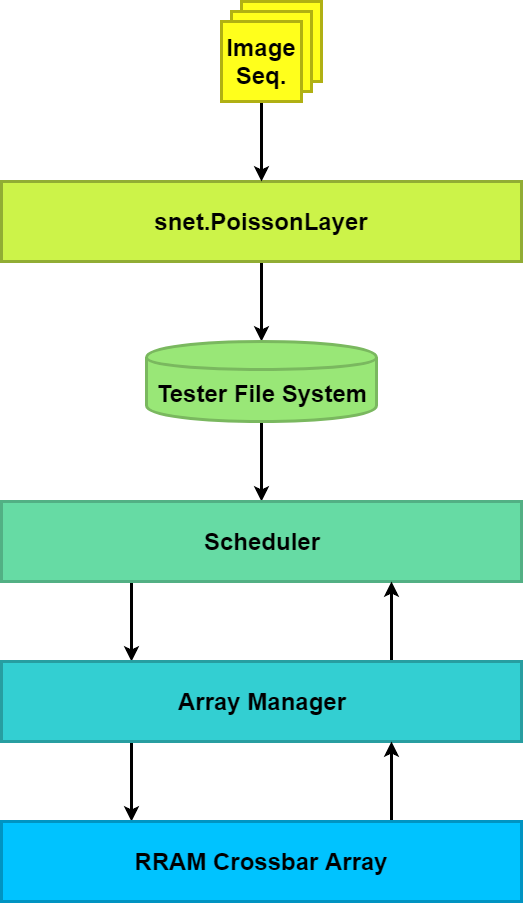

# SpikeRRAM
https://github.com/Nuullll/SpikeRRAM

## TODO List

### Overall

- [x] README doc.

- [ ] Python-c interface specification.

### SpikeNet Sim Software

- [ ] Downscaling inputs -> 11x11.

- [ ] Assess concurrency level. Reduce firing rate (if necessary).

- [ ] I/O.

### Array Tester Software

- [ ] Schedule manager design.

- [ ] I/O.

### Integration Test

- [ ] Build with tester-compatible legacy compiler.

- [ ] I/O test.

## System Architecture

### Module: Image Sequence

MNIST dataset sequence.

### Module: snet.PoissonLayer

Input layer of the SNN, implemented in python.

Responsible for:

- Category filtering. (use subset of MNIST)

- Resample input images. (28x28 to 11x11)

- Convert images to temporal spike trains.

- Reduce the firing rate, to alleviate the concurrency of different channels.

- All spike trains are generated and stored into file system before interacting with Mercury Tester platform.

- Be aware of pattern phases and background phases.

- Each image is corresponding to 2 spike trains, i.e. pattern spike train and background spike train. Both trains should cover a sufficient long duration since phase switching could happen arbitrarily.

### Module: Tester File System

Storage for input spike trains. 

### Module: Scheduler

Schedule manager for core SNN, implemented on the tester side in C.

Responsible for:

- Run a global clock to handle events with fixed rate.

- Fetch input spike trains from files. Hold each spike with corresponding duration, to stimulate the next module.

- Rearrange pulse sequence to avoid pulse concurrency thoroughly.

- Maintain the desired voltage level status for each ports/pads at any time.

- Stimulate Array Manager at the global clock rate.

- Read out the array responses from Array Manager at the global clock rate.

- Simulate LIF layer manner with the array responses.

- Switch between pattern phase and background phase.

- Fetch the next image.

### Module: Array Manager

Map input and output signals to the probe platform, to stimulate the 1K RRAM array.

No parallel operation is allowed.

Responsible for:

- Apply correct single voltage pulse to the correct port.

- Read out current for each cells.

### Module: RRAM Crossbar Array

Physical RRAM crossbar array, as the DUT of the probe platform.